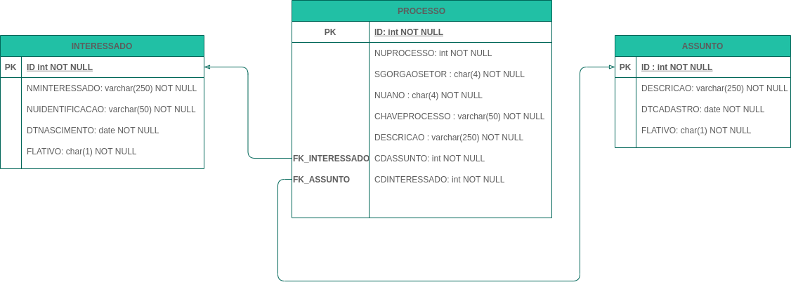

# Projeto final módulo 2 - Backend

## Descrição  

Você está participando de um processo seletivo para ingressar numa vaga de programador em uma grande empresa de TI. Uma das etapas do processo envolve a criação de uma **API RESTFULL**, para a realização de consultas, cadastros e atualizações de processos online. Para tal o usuário precisará realizar uma consulta de processos e visualizar o resultado contendo o detalhamento do processo e também oferencendo a opção de edição de informarções e exclusão do mesmo. Telas do sistema online para conhecimento pode ser vista [AQUI](https://www.figma.com/proto/BTa9Vpz4S1XUscURxANvFH5Z/DESAFIO?node-id=19%3A70&scaling=scale-down&redirected=1).

## Funcionalidades

- 1 - Deverá haver um endpoint para criação de um processo;
- 2 - Deverá haver um endpoint para listagem de todos os processos, retornando todos os atributos de cada processo;
- 3 - Deverá haver um endpoint para buscar um processo baseado na sua identificação única (ID);
- 4 - Deverá haver um endpoint para buscar um processo baseado no seu número de processo (CHAVEPROCESSO);
- 5 - Deverá haver um endpoint para buscar um ou mais processos baseado em seu interessado (CDINTERESSADO); 
- 6 - Deverá haver um endpoint para buscar um ou mais processos baseado em seu assunto (CDASSUNTO);
- 7 - Deverá haver um endpoint para atualização de todos os atributos de um processo baseado na sua identificação única (ID);
- 8 - Deverá haver um endpoint para exclusão de um processo baseado na sua identificação única (ID);
- 9 - Deverá haver um endpoint para cadastro de um interessado;
- 10 - Deverá haver um endpoint para buscar um interessado baseado na sua identificação única (ID);
- 11 - Deverá haver um endpoint para buscar um interessado baseado no documento de indentificação (NUIDENTIFICACAO);
- 12 -  Deverá haver um endpoint para cadastro de um assunto;
- 13 - Deverá haver um endpoint para buscar um assunto baseado na sua identificação única (ID);

## Regras de Negócio

* 1 - Não poderá ser cadastrado um novo processo com um id já existente;
* 2 - Não poderá ser cadastrado um novo processo com uma chave de processo  já existente;
* 3 - Não poderá ser cadastrado um novo processo com interessados inativos;
* 4 - Não poderá ser cadastrado um novo processo com assuntos inativos;
* 5 - Não poderá ser cadastrado um novo processo com interessados inesistentes no sistema;
* 6 - Não poderá ser cadastrado um novo processo com assuntos inesistentes no sistema;
* 7 - Não poderá ser cadastrado um novo interessado com um id já existente;
* 8 - Não poderá ser cadastrado um novo interessado com um mesmo documento de indentificação;    
* 9 - Não poderá ser cadastrado um novo interessado com um documento de identificação inválido;
* 10 - A formatação da chave do processo deve seguir a seguinte mascara  SGORGAOSETOR NUPROCESSO/NUANO ex: SOFT 1/2021;

## Requisitos

- Spring Boot na estrutura de projeto no backend;
- Uso de versionamento de API;
- Uso dos métodos (verbos) HTTP;
- Uso do padrão de projeto MVC;
- Uso dos respectivos status codes equivalente a cada requisição HTTP;
- O media type de arquivo ultilizado no projeto deve ser o : "application/json";
- Uso de testes unitários com no minímo de 80% de cobertura de código;
- Uso de mapeamento de ojeto relacional usando a especificação JPA;
- Uso do banco de dados PostgresSQL;

## Considerações

Considere em usar as descrições de assuntos presentes no arquivo  *carga-inicial-assuntos.txt* para a criação do script de carga inicial para a entidade ASSUNTO. 

## Modelo de Dados

## Instruções para a avaliação

- **Fork** esse [repositório](https://github.com/jeffersonoh/devinhouse-projeto-final-modulo-2) e faça o desafio numa branch se organisando com seu grupo;
- Assim que o grupo concluir o seu desafio, encaminhe o link do repositorio no AVA;
- Todos deverão participar da apresentação do projeto que tem tempo maximo de 15 minutos;
- Realize a apresentação de acordo com os requisitos solicitados neste projeto;

